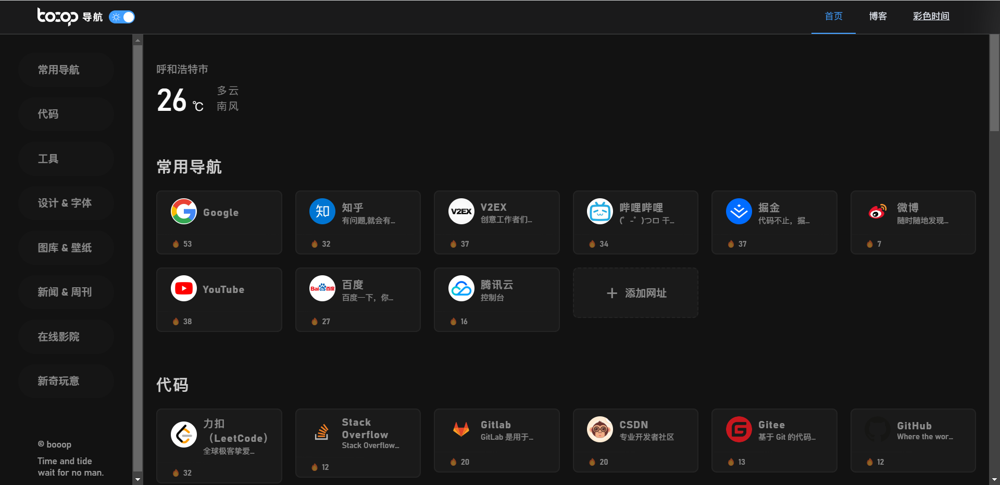

# Booop Navigation

❤️ 一个开源的网站导航练习项目

## 使用技术

- Vue 3
- Vite
- Element Plus
- Axios
- mitt.js

## 实现功能

-[x] 通过数据库读取数据
-[x] 使用通信将数据发送给`HomeAside`
-[x] 支持栏目内进行排序
-[ ] 支持将排序后的信息更新至服务器

## 截图

浅色模式

暗黑模式

